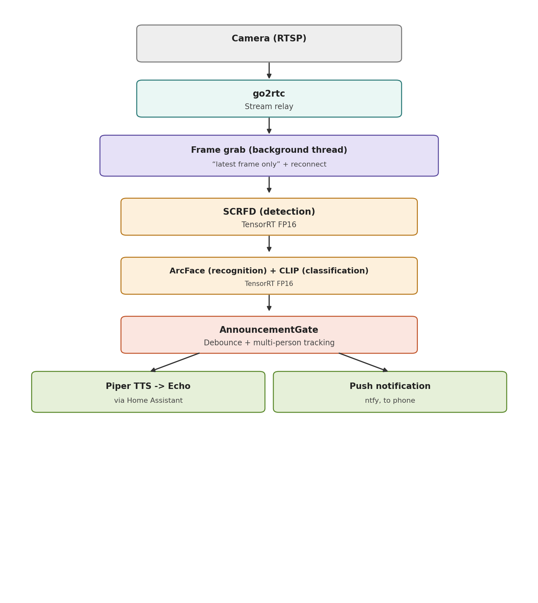

# Door-Watchman

A door camera that runs entirely on the edge — no cloud AI, no subscription.
It recognizes household members by face, flags unknown visitors, guesses
whether an unrecognized visitor is a delivery, announces known arrivals on
Amazon Echo speakers, and sends a push notification for anyone it doesn't
recognize.

Built on a Jetson Orin Nano Super, with every model compiled to TensorRT and
running locally — nothing about recognition or classification depends on an
internet connection or a third-party AI service.



## What it does

- **Detects** faces in a live RTSP camera feed (SCRFD, TensorRT)
- **Recognizes** enrolled household members (ArcFace, TensorRT) via cosine
  similarity against a small local embeddings store — no cloud face
  database, nothing leaves the device
- **Classifies** unrecognized visitors as a likely delivery or a regular
  visitor (CLIP, zero-shot, TensorRT)
- **Debounces** decisions with a rolling-window gate, so a single noisy
  frame or a person standing at the door for a while doesn't cause repeated
  or flickering announcements
- **Announces** known arrivals out loud via local text-to-speech (Piper),
  cast to Amazon Echo speakers through Home Assistant
- **Notifies** your phone for unknown/delivery visitors via a push
  notification (ntfy)
- **Learns over time**: an unrecognized visitor's photo can be manually
  enrolled later as a named person, with no retraining involved

## Hardware

| Component | Notes |
|---|---|
| Jetson Orin Nano Super Developer Kit (8GB) | Runs all inference locally |
| Wi-Fi camera with native RTSP/ONVIF | No cloud dependency for video |
| Raspberry Pi (or similar) running Home Assistant | Bridges to Amazon Echo |

See [`SETUP.md`](SETUP.md) for the full hardware/software setup sequence,
generalized from the actual build (JetPack flashing, camera setup, model
conversion, systemd services, etc.).

## Benchmarks

All figures are real, measured TensorRT FP16 engine benchmarks on this
project's Jetson Orin Nano Super (MAXN SUPER mode).

| Model | Role | Input | Mean latency | Throughput |
|---|---|---|---|---|
| SCRFD | Face detection | 640x640 | 5.83 ms | ~183 qps |
| ArcFace | Face recognition | 112x112 | 3.20 ms | ~316 qps |
| CLIP (image encoder) | Delivery classification | 224x224 | 3.50 ms | ~290 qps |

Combined sequential latency (detect -> recognize -> classify) is well under
15 ms -- comfortably real-time on a compact edge device. The actual pacing
of the system is governed by its debounce logic, not model speed.

One thing worth noting: CLIP (a transformer, ~350MB source model) runs
*faster* than SCRFD (a CNN, ~17MB source model) -- a good reminder that
TensorRT's optimization gain depends on how well an architecture's
operations map to the GPU, not just raw model size.

## Design notes worth calling out

- **"Latest frame only" capture** -- a background thread continuously
  decodes frames and keeps only the most recent one, so the pipeline never
  falls behind a growing backlog. It also self-heals: if the RTSP
  connection drops or was never established, the capture object is
  recreated automatically rather than assuming a silent retry will work.
- **Generic multi-output TensorRT wrapper** -- the engine loader discovers
  all input/output tensors by name rather than assuming a single
  input/output, which SCRFD specifically needs (9 output tensors across 3
  detection scales).
- **Debounce, not a strict repeat count** -- announcements require an
  outcome to appear a minimum number of times within a short rolling
  window, rather than strictly consecutively. This tolerates a real
  person's detection occasionally flickering to "unknown" (e.g. from a bad
  angle) without ever resetting to zero.
- **No index files where the filesystem can be the source of truth** -- e.g.
  captured visitor photos are named with an embedded timestamp and
  category, so chronological ordering and oldest-first cleanup fall out of
  a plain directory listing, with nothing that can drift out of sync.

## Known limitations

- **Off-angle recognition** -- SCRFD/ArcFace, like most face
  detection/recognition systems, are meaningfully more reliable at frontal
  to moderate angles than steep profiles. Enrolling a couple of angled
  reference photos per person helps at moderate angles; true side profiles
  remain unreliable.
- **Zero-shot delivery classification accuracy** -- CLIP does noticeably
  better when a delivery bag/uniform has visible branding/text than with
  generic, unbranded items. For notification purposes, all delivery-related
  guesses are collapsed into one "possible delivery" outcome, so
  brand-level misclassification doesn't affect what action is taken.

## Project structure

```
src/
  config.py          # centralized paths and settings (no secrets)
  trt_infer.py        # generic TensorRT engine wrapper
  utils.py            # shared image preprocessing
  scrfd_utils.py       # SCRFD post-processing (decode, NMS, multi-scale merge)
  recognize.py         # detect + align + embed + match
  classify.py          # CLIP-based delivery classification
  notify.py            # announcement text, debounce gate, TTS, push notifications
  enroll.py            # build the enrolled-faces database from photos
  live_pipeline.py      # the running application
docs/
  architecture.png
SETUP.md               # full setup guide
```

## Setup

See [`SETUP.md`](SETUP.md) for the complete, generalized setup sequence --
flashing JetPack, camera configuration, Python environment, model
conversion, and running the pipeline as a service.

## License

Add a license of your choice here before making the repo public.
